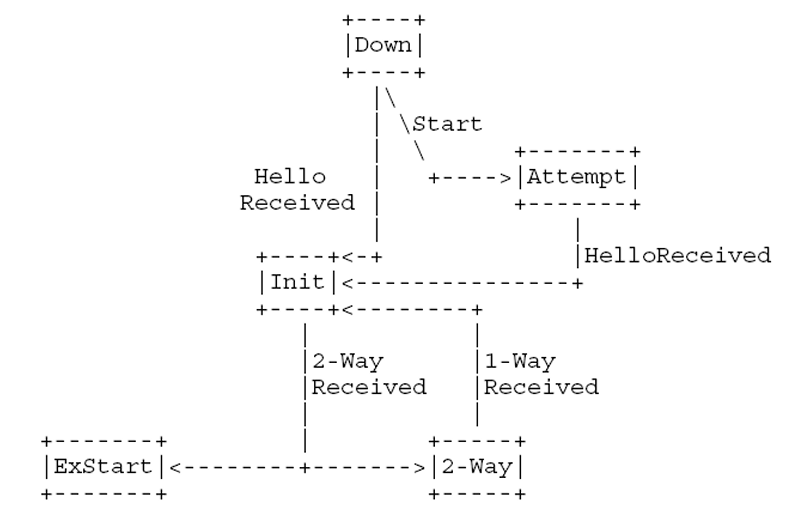
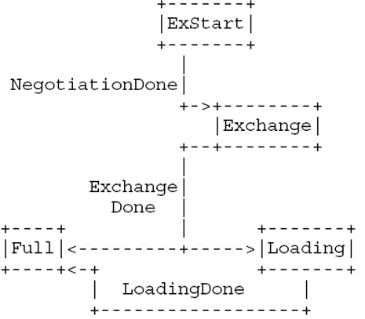

## 项目设计

### 总计架构设计

```shell
.
├── docs/
├── gns3/
├── makefile
├── readme.md
├── src/
│   ├── interface.cpp
│   ├── interface.hpp
│   ├── lsdb.cpp
│   ├── lsdb.hpp
│   ├── main.cpp
│   ├── neighbor.cpp
│   ├── neighbor.hpp
│   ├── packet.cpp
│   ├── packet.hpp
│   ├── route.cpp
│   ├── route.hpp
│   ├── transit.cpp
│   ├── transit.hpp
│   └── utils.hpp
├── style.sh
└── xmake.lua
```

本项目的文件和代码结构如下：

- `./docs`：文档
- `./gns3`：GNS3配置文件
- `./src`：OSPF实现源码
    - `packet`：各类OSPF报文和LSA数据结构、收发报文处理
    - `interface`：接口数据结构、接口状态和事件
    - `lsdb`：链路状态数据库类
    - `neighbor`：邻接数据结构、邻接状态和事件
    - `route`：路由表数据结构、路由表更新、最短路算法
    - `transit`：recv和send线程
    - `utils`：工具函数
- `xmake.lua`和`makefile`：编译配置文件

### 数据结构设计

#### OSPF包数据格式

OSPF包含5种类型的报文，分别是`Hello`、`Database Description(DD)`、`Link State Request(LSR)`、`Link State Update(LSU)`和`Link State Acknowledgment(LSAck)`，报文的结构定义参考RFC 2328的附录A3，每种报文的数据结构如下：

```cpp
namespace OSPF {

/* OSPF packet types. */
enum struct Type : uint8_t {
    HELLO = 1,
    DD,
    LSR,
    LSU,
    LSACK
};

/* OSPF packet header structure. */
struct Header {
    uint8_t version;
    Type type;
    uint16_t length;
    in_addr_t router_id;
    in_addr_t area_id;
    uint16_t checksum;
    uint16_t auth_type;
    uint64_t auth;

    void host_to_network() noexcept;
    void network_to_host() noexcept;
} __attribute__((packed));

/* OSPF hello packet structure. */
struct Hello {
    in_addr_t network_mask;
    uint16_t hello_interval;
    uint8_t options;
    uint8_t router_priority;
    uint32_t router_dead_interval;
    in_addr_t designated_router;
    in_addr_t backup_designated_router;
    in_addr_t neighbors[0];

    void host_to_network(size_t nbr_num) noexcept;
    void network_to_host() noexcept;
} __attribute__((packed));

/* OSPF database description packet structure. */
struct DD {
    uint16_t interface_mtu;
    uint8_t options;
    uint8_t flags;
#define DD_FLAG_MS 0x01
#define DD_FLAG_M 0x02
#define DD_FLAG_I 0x04
#define DD_FLAG_ALL DD_FLAG_MS | DD_FLAG_M | DD_FLAG_I
    uint32_t sequence_number;
    LSA::Header lsahdrs[0];

    void host_to_network(size_t lsahdrs_num) noexcept;
    void network_to_host() noexcept;
} __attribute__((packed));

/* OSPF link state request packet structure. */
struct LSR {
    struct Request {
        uint32_t ls_type;
        uint32_t link_state_id;
        uint32_t advertising_router;

        void host_to_network() noexcept;
        void network_to_host() noexcept;
        bool operator==(const Request& rhs) const;
    } reqs[0];

    void host_to_network(size_t reqs_num) noexcept;
    void network_to_host() noexcept;
} __attribute__((packed));

/* OSPF link state update packet structure. */
struct LSU {
    uint32_t num_lsas;
    // LSA是不定长的，很难在这里定义多个LSA
    // 将多个LSA的管理交给调用者

    void host_to_network() noexcept;
    void network_to_host() noexcept;
} __attribute__((packed));

/* OSPF link state acknowledgment packet structure. */
struct LSAck {
    LSA::Header lsahdrs[0];
} __attribute__((packed));

} // namespace OSPF
```

其中`__attribute__((packed))`是为了保证结构体的字节对齐，用于在收到和发送报文时直接使用强制类型转换，用以正确解释内存。

类似`LSA::Header lsahdrs[0];`的结构用于表示不定长结构，不使用`std::list`和`std::vector`等堆分配的数据结构以进行强制类型转换。直接在结构体中定义一个长度为0的数组，然后在使用时通过指针的方式访问该结构体内存的偏移量，然后用`memcpy`等函数进行拷贝。注意这个方式需要将`-Wall`编译选项关闭，否则会因警告造成编译失败。

#### LSA数据格式

OSPFv2中有5种LSA，分别是`Router LSA`、`Network LSA`、`Summary LSA`、`ASBR Summary LSA`和`External LSA`，分别用于描述路由器、网络、汇总、ASBR和外部路由信息。根据RFC 2328的附录A4，LSA的数据结构如下：

```cpp
namespace LSA {

/* LSA types. */
enum struct Type : uint8_t {
    ROUTER = 1,
    NETWORK,
    SUMMARY,
    ASBR_SUMMARY,
    AS_EXTERNAL
};

/* LSA header structure. */
struct Header {
    uint16_t age;
    uint8_t options;
    Type type;
    in_addr_t link_state_id;
    in_addr_t advertising_router;
    uint32_t sequence_number;
    uint16_t checksum;
    uint16_t length;

    void host_to_network() noexcept;
    void network_to_host() noexcept;
    bool operator==(const Header& rhs) const;
} __attribute__((packed));

/* Router-LSA Link types. */
enum class LinkType : uint8_t {
    POINT2POINT = 1,
    TRANSIT,
    STUB,
    VIRTUAL
};

/* Base LSA structure. */
struct Base {
    Header header;
    virtual size_t size() const = 0;

    virtual void to_packet(char *packet) const;
    virtual void make_checksum() = 0;
    bool operator<(const Base& rhs) const;
    bool operator>(const Base& rhs) const;
};

/* Router-LSA structure. */
struct Router : public Base {
    /* Router-LSA Link structure. */
    struct Link {
        in_addr_t link_id;
        in_addr_t link_data;
        LinkType type;
        uint8_t tos;
        uint16_t metric;

        Link() = default;
        Link(in_addr_t link_id, in_addr_t link_data, LinkType type, uint16_t metric);
        Link(char *net_ptr);
    } __attribute__((packed));

    uint16_t flags;
    uint16_t num_links;
    std::vector<Link> links;

    Router() = default;
    Router(char *net_ptr);
    size_t size() const override;
    void make_checksum() override;
    bool operator==(const Router& rhs) const;
};

/* Network-LSA structure. */
struct Network : public Base {
    in_addr_t network_mask;
    std::vector<in_addr_t> attached_routers;

    Network() = default;
    Network(char *net_ptr);
    size_t size() const override;
    void to_packet(char *packet) const override;
    void make_checksum() override;
    bool operator==(const Network& rhs) const;
};

/* Summary-LSA structure. */
struct Summary : public Base {
    in_addr_t network_mask;
    // union {
    //     uint8_t tos;
    //     uint32_t metric;
    // };
    uint8_t tos;
    uint32_t metric; // 实际上是24位的一个字段，需要特殊处理

    Summary(char *net_ptr);
    size_t size() const override;
    void to_packet(char *packet) const override;
    void make_checksum() override;
};

/* ASBR-summary-LSA structure. */
// ASBR-summary-LSA = Summary-LSA except for ls type

/* AS-external-LSA structure. */
struct ASExternal : public Base {
    in_addr_t network_mask;
    struct ExternRoute {
        uint8_t tos;
#define AS_EXTERNAL_FLAG 0x01
        uint32_t metric; // 同样是24位的一个字段
        in_addr_t forwarding_address;
        uint32_t external_router_tag;
    };

    std::vector<ExternRoute> e;

    ASExternal(char *net_ptr);
    size_t size() const override;
    void to_packet(char *packet) const override;
};

} // namespace LSA

using RouterLSA = LSA::Router;
using NetworkLSA = LSA::Network;
using SummaryLSA = LSA::Summary;
using ASBRSummaryLSA = LSA::Summary;
using ASExternalLSA = LSA::ASExternal;
```

其中LSA Header采用了和OSPF报文相同的紧密字节对齐方式，而派生的LSA结构体采用了面向对象的模式。这么设计是考虑到以下实践：
- LSA的Header部分在收发报文时需要频繁判断类型，此过程不需要进行网络序和主机序的转换，直接用强制类型转换的方式判断即可；
- LSA本身信息只有在计算路由时会用到，因此在收发报文时不需要对LSA的具体内容进行解析，通过构造函数和`to_packet`函数实现实现不同LSA的序列化和反序列化，使用一些堆区分配的数据结构可以使得访问和管理更加方便。

`Summary-LSA`和`ASBR-Summary-LSA`定义是完全一致的，因此直接使用`Summary-LSA`即可。`Summary-LSA`和`AS-external-LSA`中的`metric`字段是24位的，需要特殊处理。

#### 接口数据结构

接口表示路由器上可以用于收发报文的设备，用以连接路由器和网络，每个OSPF接口接入各自的网络/子网，可以认为接口属于包含其接入网络的区域，由路由器发出的LSA反映其状态和相关联的邻接。根据RFC 2328的第9节，接口的数据结构如下：

```cpp
class Interface {
public:
    /* 接口的类型 */
    enum class Type {
        P2P = 1,
        BROADCAST,
        NBMA,
        P2MP,
        VIRTUAL
    } type = Type::BROADCAST;

    /* 接口的功能层次 */
    enum class State {
        DOWN,
        LOOPBACK,
        WAITING,
        POINT2POINT,
        DROTHER,
        BACKUP,
        DR
    } state = State::DOWN;

    /* 接口ip地址 */
    in_addr_t ip_addr;
    /* 接口子网掩码 */
    in_addr_t mask;
    /* 区域标识 */
    uint32_t area_id;

    /* 从该接口发送Hello报文的时间间隔 */
    uint32_t hello_interval = 10;
    /* 当不再收到路由器的Hello包后，宣告邻居断开的时间间隔 */
    uint32_t router_dead_interval = 40;
    /* 向该接口的邻接重传LSA的时间间隔 */
    uint32_t rxmt_interval = 5;
    /* 接口上发送一个LSU包所需要的大致时间 */
    uint32_t intf_trans_delay = 1;

    /* 路由器优先级 */
    uint8_t router_priority = 1;

    /* Hello计时器 */
    uint32_t hello_timer = 0;
    /* Wait计时器 */
    uint32_t wait_timer = 0;

    /* 该接口的邻接路由器 */
    std::list<Neighbor *> neighbors;

    /* 选举出的DR */
    in_addr_t designated_router = 0;
    /* 选举出的BDR */
    in_addr_t backup_designated_router = 0;

    /* 接口输出值，即在Router-LSA中宣告的连接状态距离值 */
    uint32_t cost = 1;

    /* 验证类型 */
    uint16_t auth_type;
    /* 验证密码 */
    uint64_t auth_key;

    /* 接口名称 */
    char name[IFNAMSIZ];

    /* 接口index */
    int if_index;

public:
    /* 改变接口状态的事件 */
    void event_interface_up();
    void event_wait_timer();
    void event_backup_seen();
    void event_neighbor_change();
    void event_loop_ind();
    void event_unloop_ind();
    void event_interface_down();

    Neighbor *get_neighbor_by_id(in_addr_t id);
    Neighbor *get_neighbor_by_ip(in_addr_t ip);

public:
    /* loop fd，不在构造函数中初始化，避免抛出异常 */
    int send_fd;
    int recv_fd;

public:
    Interface() = default;
    Interface(in_addr_t ip_addr, in_addr_t mask, uint32_t area_id) : ip_addr(ip_addr), mask(mask), area_id(area_id) {
    }
    ~Interface();

private:
    /* 选举DR和BDR */
    void elect_designated_router();
};
```

接口中存储了接口收发报文以及邻居管理的一些必要信息。接口有类型字段，表示的是接入网络的类型，在本实验中主要为广播类型。接口的状态由一定的时间进行转移，反映了接口的工作情况和职责。

DR和BDR的选举是通过接口的`elect_designated_router`函数实现的，该函数会在接口状态改变时调用，通过比较邻接路由器的优先级和IP地址来选举DR和BDR。选举的结果会在接口的`designated_router`和`backup_designated_router`字段中记录。

接口的信息实际上是需要在路由器的Console中用命令行配置的，但本实验用主机模拟路由器功能，因此在本项目中实现了接口动态读取的功能，通过`init_interfaces`实现：

```cpp
void init_interfaces() {
    int fd = socket(AF_INET, SOCK_DGRAM, 0);
    if (fd < 0) {
        exit(EXIT_FAILURE);
    }

    ifreq ifr[MAX_INTERFACE_NUM];

    ifconf ifc;
    ifc.ifc_len = sizeof(ifr);
    ifc.ifc_req = ifr;
    if (ioctl(fd, SIOCGIFCONF, &ifc) < 0) {
        close(fd);
        exit(EXIT_FAILURE);
    }

    int num_ifr = ifc.ifc_len / sizeof(ifreq);

    for (auto i = 0; i < num_ifr; ++i) {
        if (strstr(ifr->ifr_name, "lo") != nullptr || strstr(ifr->ifr_name, "docker") != nullptr) {
            continue;
        }

        // fetch interface name, ip addr, mask
        auto intf = new Interface();
        strncpy(intf->name, ifr->ifr_name, IFNAMSIZ);
        if (ioctl(fd, SIOCGIFADDR, ifr) < 0) {
            perror("ioctl SIOCGIFADDR");
            delete intf;
            continue;
        }
        intf->ip_addr = ntohl(((sockaddr_in *)&ifr->ifr_addr)->sin_addr.s_addr);
        if (ioctl(fd, SIOCGIFNETMASK, ifr) < 0) {
            perror("ioctl SIOCGIFNETMASK");
            delete intf;
            continue;
        }
        intf->mask = ntohl(((sockaddr_in *)&ifr->ifr_addr)->sin_addr.s_addr);
        intf->area_id = 0;

        // fetch interface index
        if (ioctl(fd, SIOCGIFINDEX, ifr) < 0) {
            perror("ioctl SIOCGIFINDEX");
            delete intf;
            continue;
        }
        intf->if_index = ifr->ifr_ifindex;

        // turn on promisc mode
        if (ioctl(fd, SIOCGIFFLAGS, ifr) < 0) {
            perror("ioctl SIOCGIFFLAGS");
            delete intf;
            continue;
        }
        ifr->ifr_flags |= IFF_PROMISC;
        if (ioctl(fd, SIOCSIFFLAGS, ifr) < 0) {
            perror("ioctl SIOCSIFFLAGS");
            delete intf;
            continue;
        }

        // alloc send fd
        int socket_fd;
        ifreq socket_ifr;
        if ((socket_fd = socket(AF_INET, SOCK_RAW, IPPROTO_OSPF)) < 0) {
            perror("send socket_fd init");
            delete intf;
            continue;
        }
        memset(&socket_ifr, 0, sizeof(ifreq));
        strcpy(socket_ifr.ifr_name, intf->name);
        if (setsockopt(socket_fd, SOL_SOCKET, SO_BINDTODEVICE, &socket_ifr, sizeof(ifreq)) < 0) {
            perror("send_loop: setsockopt");
            delete intf;
            continue;
        }
        intf->send_fd = socket_fd;

        // alloc recv fd
        if ((socket_fd = socket(AF_PACKET, SOCK_RAW, htons(ETH_P_IP))) < 0) {
            perror("recv socket_fd init");
            delete intf;
            continue;
        }
        memset(&socket_ifr, 0, sizeof(ifreq));
        strcpy(socket_ifr.ifr_name, intf->name);
        if (setsockopt(socket_fd, SOL_SOCKET, SO_BINDTODEVICE, &socket_ifr, sizeof(ifreq)) < 0) {
            perror("recv_loop: setsockopt");
            delete intf;
            continue;
        }
        intf->recv_fd = socket_fd;

        // add to interfaces
        this_interfaces.push_back(intf);
    }

    close(fd);

    std::cout << "Found " << this_interfaces.size() << " interfaces." << std::endl;
    for (auto intf : this_interfaces) {
        std::cout << "Interface " << intf->name << ":" << std::endl
                  << "\tip addr:" << ip_to_str(intf->ip_addr) << std::endl
                  << "\tmask:" << ip_to_str(intf->mask) << std::endl;
        intf->hello_timer = 0;
        intf->wait_timer = 0;
        intf->event_interface_up();
    }
}
```

通过`ioctl`函数获取接口的IP地址、子网掩码、接口名和索引等信息，然后通过`socket`函数创建接口的发送和接收套接字，通过`setsockopt`函数将套接字绑定到接口上，实现接口的数据收发。注意需要排除本地回环接口和docker接口，因为这些接口不参与OSPF协议的实现。

#### 邻接数据结构

邻接表示路由器之间的相邻关系，每个会话被限定在特定的路由器接口上，并由邻居的OSPF路由器标识。根据RFC 2328的第10节，邻接的数据结构如下：

```cpp
class Neighbor {
public:
    /* 邻居的状态 */
    enum class State {
        DOWN = 0,
        ATTEMPT,
        INIT,
        TWOWAY,
        EXSTART,
        EXCHANGE,
        LOADING,
        FULL
    } state = State::DOWN;

    /* 非活跃计时器 */
    uint32_t inactivity_timer = 40;

    /* 是否为master */
    bool is_master = false;

    /* DD包的序列号 */
    uint32_t dd_seq_num;

    /* 最后一个DD包，用于重传 */
    uint32_t recv_dd_seq_num;

    /* 最后一个发出的DD包的长度和数据 */
    uint32_t last_dd_data_len;
    char last_dd_data[ETH_DATA_LEN];

    /* 记录上一次传输的dd包中lsahdr的数量 */
    size_t dd_lsahdr_cnt = 0;
    /* 是否收到了!FLAG_M的DD包 */
    bool dd_recv_no_more = false;

    /* 邻居的路由器标识 */
    uint32_t id;
    /* 邻居的优先级 */
    uint32_t priority;
    /* 邻居的IP地址 */
    in_addr_t ip_addr;

    /* 邻居的指定路由器 */
    in_addr_t designated_router;
    /* 邻居的备份指定路由器 */
    in_addr_t backup_designated_router;

    Interface *host_interface;

    /* 邻居的重传计时器 */
    uint32_t rxmt_timer = 0;

    /* 需要重传的链路状态数据 */
    std::list<LSA::Base *> link_state_rxmt_list;

    /* Exchange状态下的链路状态数据 */
    std::list<LSA::Header *> db_summary_list; // 不会被同时访问，不需要加锁
    std::list<LSA::Header *>::iterator db_summary_send_iter;

    /* Exchange和Loading状态下需要请求的链路状态数据 */
    std::list<OSPF::LSR::Request> link_state_request_list;
    std::mutex link_state_request_list_mtx; // 因为exchange阶段就在发lsr了，会被同时访问

    /* Exchange和Loading状态下收到的链路状态请求，准备用于lsu中发送 */
    std::list<LSA::Base *> lsa_update_list;

    /* 邻居DD选项 */
    uint8_t dd_options;

    /* 向邻居发送的DD包，Init标志 */
    bool dd_init = true;

public:
    Neighbor(in_addr_t ip_addr, Interface *interface) : ip_addr(ip_addr), host_interface(interface) {
        // dd_rtmx = false;
        // dd_ack = false;
    }
    ~Neighbor() = default;

public:
    void event_hello_received();
    void event_start();
    void event_2way_received();
    void event_negotiation_done();
    void event_exchange_done();
    void event_bad_lsreq();
    void event_loading_done();
    void event_adj_ok();
    void event_seq_number_mismatch();
    void event_1way_received();
    void event_kill_nbr();
    void event_inactivity_timer();
    void event_ll_down();

private:
    bool estab_adj() noexcept;
};
```

接口中存储了接口收发报文以及邻居管理的一些必要信息。邻居有状态字段，表示的是邻居的状态，根据OSPF协议的状态机，邻居的状态会随着事件的发生而改变，如收到Hello报文、超时等，这些事件会改变邻居的状态，从而影响邻居的行为。

邻居状态机是整个OSPF协议的核心，通过邻居状态机的状态转移来实现邻接的建立和链路状态的同步。完整的邻居状态机如图下面两张图片所示：

由Hello报文触发：


由数据库更新触发：
