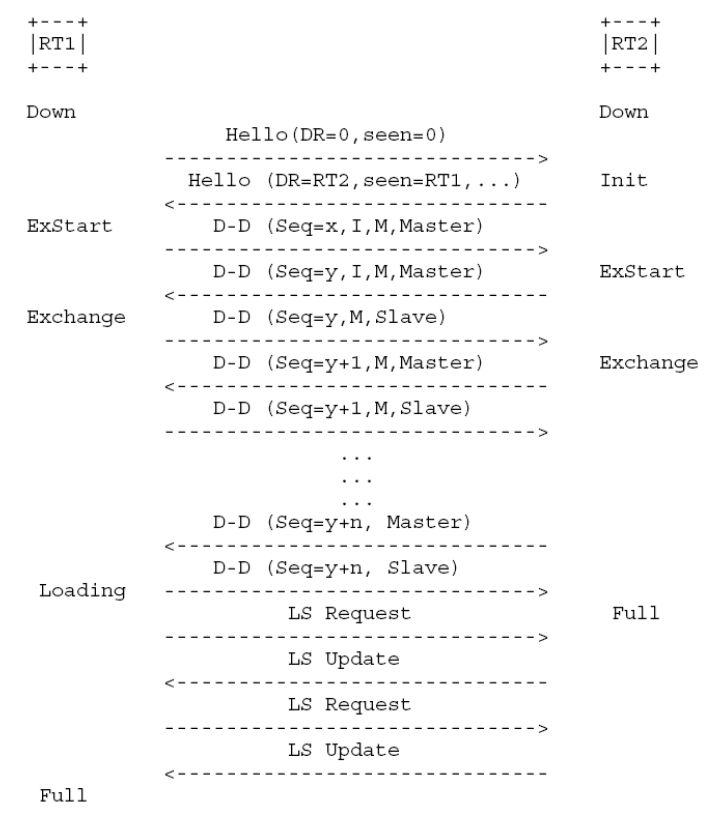

## 项目实现

### 邻接关系建立

建立邻接关系的核心是`Hello`报文的处理。通过`Hello`报文发现邻接路由器，邻居状态机从`Down`进入`Init`状态。

再收到`Hello`报文后，如果邻居的`Hello`报文中包含自己，就根据网络类型进入`2-Way`或`ExStart`状态。前者代表不需要建立**邻接**关系，会保持`2-way`状态并持续等待`adj_ok?`事件；后者代表需要建立**邻接**关系，接口会进行选举。

```cpp
void process_hello(Interface *intf, char *ospf_packet, in_addr_t src_ip) {
    auto ospf_hdr = reinterpret_cast<OSPF::Header *>(ospf_packet);
    auto ospf_hello = reinterpret_cast<OSPF::Hello *>(ospf_packet + sizeof(OSPF::Header));
    // auto nbr = intf->get_neighbor(src_ip);
    // if (nbr == nullptr) {
    //     nbr = intf->add_neighbor(src_ip);
    // }
    Neighbor *nbr = intf->get_neighbor_by_ip(src_ip);
    if (nbr == nullptr) {
        nbr = new Neighbor(src_ip, intf);
        intf->neighbors.push_back(nbr);
    }

    nbr->id = ospf_hdr->router_id; // hdr已经是host字节序
    auto prev_ndr = nbr->designated_router;
    auto prev_nbdr = nbr->backup_designated_router;
    nbr->designated_router = ntohl(ospf_hello->designated_router);
    nbr->backup_designated_router = ntohl(ospf_hello->backup_designated_router);
    nbr->priority = ntohl(ospf_hello->router_priority);

    nbr->event_hello_received();

    auto to_2way = false;
    // 1way/2way: hello报文中的neighbors列表中是否包含自己
    in_addr_t *attached_nbr = ospf_hello->neighbors;
    while (attached_nbr != reinterpret_cast<in_addr_t *>(ospf_packet + ospf_hdr->length)) {
        if (*attached_nbr == inet_addr(THIS_ROUTER_ID)) {
            to_2way = true;
            break;
        }
        attached_nbr++;
    }
    if (to_2way) {
        // 邻居的Hello报文中包含自己，触发2way事件
        // 如果在这里需要建立邻接，邻接会直接进入exstart状态
        // 否则会进入并维持在2way状态，等待adj_ok事件
        nbr->event_2way_received();
    } else {
        nbr->event_1way_received();
        return;
    }

    if (nbr->designated_router == nbr->ip_addr && nbr->backup_designated_router == 0 &&
        intf->state == Interface::State::WAITING) {
        // 如果邻居宣称自己是DR，且自己不是BDR
        intf->event_backup_seen();
    } else if ((prev_ndr == nbr->ip_addr) ^ (nbr->designated_router == nbr->ip_addr)) {
        intf->event_neighbor_change();
    }
    if (nbr->backup_designated_router == nbr->ip_addr && intf->state == Interface::State::WAITING) {
        // 如果邻居宣称自己是BDR
        intf->event_backup_seen();
    } else if ((prev_nbdr == nbr->ip_addr) ^ (nbr->backup_designated_router == nbr->ip_addr)) {
        intf->event_neighbor_change();
    }
}
```

### 链路状态数据库同步

#### Exstart和Exchange状态

在`ExStart`状态下，选举出Master和Slave，这里rfc2328写的并不是很详细。在初始的时候，会给邻接数据结构一个设定的`dd_seq_num`值。

主从关系的确立的核心**认可主从关系**。对两个路由器而言，最初都认为自己是Master。这时如果一个路由器发现对方发送的、带有I、M、MS标志位的`DD`报文的`Router ID`比自己的大，就会认可自己是Slave，并将自己的`dd_seq_num`改为对方的值，进入`Exchange`状态；如果不然，这个`DD`报文**会被忽略**，这个时候未来会成为Master的这个路由器**并没有认可自己为Master**。

在Slave认可主从关系后，会回应一个不带有I、MS标志位的`DD`报文，这个报文（一般）**会带有自己数据库的摘要信息**，即`LSA Header`（这一点需要抓包才能看出来，标准中略过了这里的细节）。路由器接收到这个不带有I、MS标志位的`DD`报文，并且发现其中的`dd_seq_num`和自己相同（Slave已经认可了主从关系），且对方`Router ID`小于自己，就认可自己为Master，进入`Exchange`状态。需要注意的是，需要处理这个`DD`报文中的摘要信息。

在`Exchange`阶段，只有Master能够主动发送`DD`报文，并且超时重传。Slave只能在接收到Master的`DD`报文后立即回复。而且，Master只有在收到了希望接收的`DD`报文后才能发送下一个`DD`报文，否则等待超时重传。相应的是，如果两边报文都合理接收的话，这一阶段是没有等待的。

需要注意的是，当Slave已经收到了不含M标志位的报文，在发送`DD`报文时发现没有`LSA`需要发送，就会进入`Loading`状态或`Full`状态。而Master在收到不含M标志位的报文后，发现自己的`db_summary_list`为空，就会进入`Loading`或`Full`状态。**此处Slave状态切换一定会先于Master**。

```cpp
size_t produce_dd(char *body, Neighbor *nbr) {
    auto dd = reinterpret_cast<OSPF::DD *>(body);
    size_t dd_len;
    dd->interface_mtu = ETH_DATA_LEN;
    dd->options = 0x02;
    dd->sequence_number = nbr->dd_seq_num;
    dd->flags = 0;
    if (!nbr->is_master) {
        dd->flags |= DD_FLAG_MS;
    }
    if (nbr->dd_init) {
        dd->flags |= DD_FLAG_I;
    }

    dd_len = sizeof(OSPF::DD);
    if (nbr->dd_init) {
        dd->host_to_network(0);
    } else {
        auto lsahdr = dd->lsahdrs;
        if (nbr->db_summary_list.size() > dd_max_lsahdr_num) {
            std::advance(nbr->db_summary_send_iter, dd_max_lsahdr_num);
            dd->flags |= DD_FLAG_M;
            for (auto it = nbr->db_summary_list.begin(); it != nbr->db_summary_send_iter; ++it) {
                memcpy(lsahdr, *it, sizeof(LSA::Header));
                lsahdr++;
            }
            dd_len += sizeof(LSA::Header) * dd_max_lsahdr_num;
            dd->host_to_network(dd_max_lsahdr_num);
        } else {
            // 本次发送剩下所有lsahdr
            nbr->db_summary_send_iter = nbr->db_summary_list.end();
            for (auto it = nbr->db_summary_list.begin(); it != nbr->db_summary_list.end(); ++it) {
                memcpy(lsahdr, *it, sizeof(LSA::Header));
                lsahdr++;
            }
            dd_len += sizeof(LSA::Header) * nbr->db_summary_list.size();
            dd->host_to_network(nbr->db_summary_list.size());
            // 如果slave已收到!M的包，而且无lsahdr需要发送
            if (nbr->is_master && nbr->dd_recv_no_more) {
                nbr->event_exchange_done();
                nbr->db_summary_list.clear();
            }
        }
    }

    return dd_len;
}

void process_dd(Interface *intf, char *ospf_packet, in_addr_t src_ip) {
    auto ospf_hdr = reinterpret_cast<OSPF::Header *>(ospf_packet);
    auto ospf_dd = reinterpret_cast<OSPF::DD *>(ospf_packet + sizeof(OSPF::Header));
    Neighbor *nbr = intf->get_neighbor_by_ip(src_ip);
    assert(nbr != nullptr);
    ospf_dd->network_to_host();

    bool dup = nbr->recv_dd_seq_num == ospf_dd->sequence_number;
    nbr->recv_dd_seq_num = ospf_dd->sequence_number;

    bool accept = false;

    switch (nbr->state) {
    case Neighbor::State::DOWN:
    case Neighbor::State::ATTEMPT:
    case Neighbor::State::TWOWAY:
        return;
    case Neighbor::State::INIT:
        nbr->event_2way_received();
        if (nbr->state == Neighbor::State::TWOWAY) {
            return;
        }
        // 如果变为exstart状态，直接进入下一个case
        // 在此处不需要break
    case Neighbor::State::EXSTART:
        nbr->dd_options = ospf_dd->options;
        if (ospf_dd->flags & DD_FLAG_ALL && nbr->id > ntohl(inet_addr(THIS_ROUTER_ID))) {
            nbr->is_master = true;
            nbr->dd_seq_num = ospf_dd->sequence_number;
        } else if (!(ospf_dd->flags & DD_FLAG_MS) && !(ospf_dd->flags & DD_FLAG_I) &&
                   ospf_dd->sequence_number == nbr->dd_seq_num && nbr->id < ntohl(inet_addr(THIS_ROUTER_ID))) {
            nbr->is_master = false;
        } else {
            // 将要成为master收到了第一个DD包，无需处理
            return;
        }
        nbr->dd_init = false;
        nbr->event_negotiation_done();
        if (nbr->is_master) {
            // 如果自己是slave，发送这样一个DD包：
            // 1. MS和I位置0
            // 2. 序列号为邻居的dd_seq_num
            // 3. 包含lsahdr
            // 此时已经是exchange状态，这很重要
            nbr->last_dd_data_len = produce_dd(nbr->last_dd_data + sizeof(OSPF::Header), nbr);
            send_packet(intf, nbr->last_dd_data, nbr->last_dd_data_len, OSPF::Type::DD, nbr->ip_addr);
            return;
        }
        // 如果是master，这里收到dd包必然不为空
        // 在切换到exchange状态后按照exchange状态的处理方式处理
        // 这里不需要break
    case Neighbor::State::EXCHANGE:
        // 如果收到了重复的DD包
        if (dup) {
            if (nbr->is_master) {
                // slave需要重传上一个包，master的重传通过计时器实现
                send_packet(intf, nbr->last_dd_data, nbr->last_dd_data_len, OSPF::Type::DD, nbr->ip_addr);
            }
            return;
        } else {
            // 主从关系不匹配
            if ((bool)(ospf_dd->flags & DD_FLAG_MS) != nbr->is_master) {
                nbr->event_seq_number_mismatch();
                return;
            }
            // 意外设定了I标志
            if (ospf_dd->flags & DD_FLAG_I) {
                nbr->event_seq_number_mismatch();
                return;
            }
        }
        // 如果选项域与过去收到的不一致
        if (nbr->dd_options != ospf_dd->options) {
            nbr->event_seq_number_mismatch();
            return;
        }
        if (nbr->is_master &&                                  // 自己为 slave
            ospf_dd->sequence_number == nbr->dd_seq_num + 1) { // 对于slave，下一个包应当是邻接记录的dd_seq_num + 1
            nbr->dd_seq_num = ospf_dd->sequence_number;
            accept = true;
        } else if (!nbr->is_master &&                             // 自己为master
                   ospf_dd->sequence_number == nbr->dd_seq_num) { // 对于master，下一个包应当为邻居记录的dd_seq_num
            nbr->dd_seq_num += 1;
            accept = true;
        } else {
            nbr->event_seq_number_mismatch();
            return;
        }
        break;
    case Neighbor::State::LOADING:
    case Neighbor::State::FULL:
        // 主从关系不匹配
        if ((bool)(ospf_dd->flags & DD_FLAG_MS) != nbr->is_master) {
            nbr->event_seq_number_mismatch();
            return;
        }
        // 意外设定了I标志
        if (ospf_dd->flags & DD_FLAG_I) {
            nbr->event_seq_number_mismatch();
            return;
        }
        // slave收到重复的DD包
        if (nbr->is_master && dup) {
            send_packet(intf, nbr->last_dd_data, nbr->last_dd_data_len, OSPF::Type::DD, nbr->ip_addr);
            return;
        }
        break;
    default:
        break;
    }

    if (accept) {
        // 视为回复，将db_summary_list中上一次发送的lsahdr删除（可能为空）
        nbr->db_summary_list.erase(nbr->db_summary_list.begin(), nbr->db_summary_send_iter);

        // 收到了!M的DD包
        nbr->dd_recv_no_more = !(ospf_dd->flags & DD_FLAG_M);

        // 将收到的lsahdr加入link_state_request_list
        auto num_lsahdrs = (ospf_hdr->length - sizeof(OSPF::Header) - sizeof(OSPF::DD)) / sizeof(LSA::Header);
        LSA::Header *lsahdr = ospf_dd->lsahdrs;
        for (auto i = 0; i < num_lsahdrs; ++i) {
            lsahdr->network_to_host();
            nbr->link_state_request_list_mtx.lock();
            this_lsdb.lock();
            if (this_lsdb.get(lsahdr->type, lsahdr->link_state_id, lsahdr->advertising_router) == nullptr) {
                nbr->link_state_request_list.push_back(
                    {(uint32_t)lsahdr->type, lsahdr->link_state_id, lsahdr->advertising_router});
            }
            this_lsdb.unlock();
            nbr->link_state_request_list_mtx.unlock();
            lsahdr++;
        }

        // 从本质上说，master和slave都需要立即回复
        // master需要在此处完成exchange_done事件
        if (!nbr->is_master) {
            if (nbr->db_summary_list.empty() && nbr->dd_recv_no_more) {
                nbr->event_exchange_done();
                return;
            }
        }
        nbr->last_dd_data_len = produce_dd(nbr->last_dd_data + sizeof(OSPF::Header), nbr);
        send_packet(intf, nbr->last_dd_data, nbr->last_dd_data_len, OSPF::Type::DD, nbr->ip_addr);
    }
}
```

#### Loading和Full状态

事实上，`LSR`包的构造在Exchange阶段就已经开始，当邻居数据结构中`link_state_request_list`不为空时，就应该构造并发送`LSR`包。路由器将连接状态请求列表的开始部分头部n个，包含在`LSR`包中发给邻居，来取得这些`LSA`。当邻居以适当的`LSU`包，回应了这些请求后，删减连接状态请求列表的头部n个，并发出新的`LSR`包。在实际实现中通过一个链表来管理`link_state_request_list`。继续这一过程，直到连接状态请求列表为空。那些在连接状态请求列表中，已经发出，但还没有收到的`LSA`，被包含在`LSR`包中，以`RxmtInterval`的周期重传。在任何时候，都至多发送一个`LSR`包。

当路由器收到`LSR`包时，应当在立即在路由器的数据库中检索LSR包中的每个`LSA`，并将其复制到`LSU`包中发往邻居。这些`LSA`**不**应当被放入邻居的连接状态重传列表中。如果某个`LSA`没有在数据库中被找到，说明在数据库交换过程中出错，应当生成BadLSReq邻居事件。

当邻居状态为Loading而连接状态请求列表为空时（也就是已经与邻居完整地收发了全部的`DD`包），生成 LoadingDone 邻居事件，由Loading进入Full状态。在Full状态下，邻居已经完全同步了数据库，视为已经完全建立了邻接关系。

建立一对邻接关系的完整过程如下：



### DR和BDR选举

DR和BDR的选举参考RFC 2328的9.4节完成。

无论是接口数据结构、邻接数据结构或是Hello包中，**DR和BDR字段记录的都是关联接口的IP地址**，而不是路由器ID。

路由选举由接口状态机调用。当网络上的路由器第一次运行选举算法时，将网络上的 DR 和 BDR 都初始设置为 `0.0.0.0`，表示目前没有 DR 和 BDR 存在。选举算法的过程如下：执行选举的路由器称为 X，首先检查该网络上与路由器 X 已建立双向通信的其他路由器列表。这个列表包含与 X 至少达到了 2-Way 状态的所有邻居路由器，包括路由器 X 自己。接着，从列表中排除那些优先级为 0、不能成为 DR 的路由器，并按以下步骤进行计算：

1. 记录网络上当前的 DR 和 BDR 数值，以便后续比较。
2. 计算网络上的 BDR：在列表中，排除宣告自己为 DR 的路由器后，选择宣告自己为 BDR 的路由器中拥有最高优先级的作为 BDR；如果优先级相同，则选择标识符最大的路由器。如果没有路由器宣告自己为 BDR，则选择列表中拥有最高优先级的路由器作为 BDR，再根据标识符进行选择。
3. 计算网络上的 DR：选择列表中宣告自己为 DR 的路由器中拥有最高优先级的作为 DR；如果优先级相同，则选择标识符最大的路由器。如果没有路由器宣告自己为 DR，则将新选出的 BDR 设定为 DR。
4. 如果路由器 X 新近成为 DR 或 BDR，或不再是 DR 或 BDR，重复步骤 2 和 3，并排除自己参与 BDR 的选举，这样路由器不会同时成为 DR 和 BDR。
5. 选举结束后，路由器按需设置新的接口状态为 DR、Backup 或 DR Other。
6. 如果路由器接入的是 NBMA 网络且成为 DR 或 BDR，它需向不能成为 DR 的路由器发送 Hello 包。
7. 选举导致 DR 或 BDR 变化时，需要对达到至少 2-Way 状态的邻居调用事件，以重新检查关联接口上的邻接。

这种复杂的选举算法确保在当前 DR 失效时，BDR 能顺利接替，并通过适当的滞后来进行顺利过渡。在某些情况下，可能会选举一台路由器同时成为 DR 和 BDR，或者 DR 和 BDR 的优先级不一定是最高和次高的路由器。最后，若路由器 X 是唯一可能成为 DR 的，它将选择自己为 DR 而不会有 BDR，这种情况很奇怪，但是在实际情况下确实会发生。

```cpp
void Interface::elect_designated_router() {
    // printf("\n\n\tStart electing DR and BDR...\n");
    std::cout << "Start electing DR and BDR..." << std::endl;

    std::list<Neighbor *> candidates;

    // 1. Select Candidates
    Neighbor self(ip_addr, this);
    self.id = ntohl(inet_addr(THIS_ROUTER_ID));
    self.designated_router = designated_router;
    self.backup_designated_router = backup_designated_router;
    candidates.emplace_back(&self);

    for (auto& neighbor : neighbors) {
        if (static_cast<uint8_t>(neighbor->state) >= static_cast<uint8_t>(Neighbor::State::TWOWAY) &&
            neighbor->priority != 0) {
            candidates.emplace_back(neighbor);
        }
    }

    // 2. Elect DR and BDR
    Neighbor *dr = nullptr;
    Neighbor *bdr = nullptr;

    // 2.1 Elect BDR
    std::vector<Neighbor *> bdr_candidates_lv1;
    std::vector<Neighbor *> bdr_candidates_lv2;
    for (auto& candidate : candidates) {
        if (candidate->designated_router != candidate->ip_addr) {
            bdr_candidates_lv2.emplace_back(candidate);
            if (candidate->backup_designated_router == candidate->ip_addr) {
                bdr_candidates_lv1.emplace_back(candidate);
            }
        }
    }

    auto neighbor_cmp = [](Neighbor *a, Neighbor *b) {
        if (a->priority != b->priority) {
            return a->priority > b->priority;
        } else {
            return a->id > b->id;
        }
    };
    if (!bdr_candidates_lv1.empty()) {
        bdr = *std::max_element(bdr_candidates_lv1.begin(), bdr_candidates_lv1.end(), neighbor_cmp);
    } else if (!bdr_candidates_lv2.empty()) {
        bdr = *std::max_element(bdr_candidates_lv2.begin(), bdr_candidates_lv2.end(), neighbor_cmp);
    } // lv2 must be not empty

    // 2.2 Elect DR
    std::vector<Neighbor *> dr_candidates;
    for (auto& candidate : candidates) {
        if (candidate->designated_router == candidate->ip_addr) {
            dr_candidates.emplace_back(candidate);
        }
    }
    if (!dr_candidates.empty()) {
        dr = *std::max_element(dr_candidates.begin(), dr_candidates.end(), neighbor_cmp);
    } else {
        dr = bdr; // emmm...
    }

    auto old_dr = designated_router;
    auto old_bdr = backup_designated_router;

    designated_router = dr->ip_addr;
    backup_designated_router = bdr->ip_addr;
    // designated_router = dr->id;
    // backup_designated_router = bdr->id;

    // If DR/BDR changed
    if (old_dr != designated_router || old_bdr != backup_designated_router) {
        for (auto& neighbor : neighbors) {
            // rfc2328中说，一旦DR/BDR改变，就要检查是否需要建立(2-way->exstart)/维持(any->2-way)邻接
            if (neighbor->state >= Neighbor::State::TWOWAY) {
                neighbor->event_adj_ok();
            }
        }
    }

    if (dr->ip_addr == ip_addr && designated_router != ip_addr) {
        MAKE_NETWORK_LSA(this);
    }

    // printf("\n\tnew DR: %x\n", designated_router);
    // printf("\n\tnew BDR: %x\n", backup_designated_router);
    // printf("Electing finished.\n");
    std::cout << "\tnew DR: " << ip_to_str(designated_router) << std::endl;
    std::cout << "\tnew BDR: " << ip_to_str(backup_designated_router) << std::endl;
    std::cout << "Electing finished." << std::endl;
}
```

### 最短路径计算

最短路和路由表的计算参考RFC 2328的16节完成。

#### 解析LSA并构造结点和边

路由表的计算需要解析LSA内容，如下：
- 所有LSA都有一个相同的`Header`结构，用于描述LSA的基本信息。在不同的LSA中，`link_state_id`的含义不同。在Router LSA中，`link_state_id`为生成该LSA对应的**路由器ID**；在`Network LSA`中，`link_state_id`为该网段**DR的接口IP地址**。
- `Router LSA`由每个配置了ospf的路由器生成，描述该路由器接入该区域的接口，称为`Link`。如果网络类型均为`Transit`，因此`link_id`为DR的接口IP地址，`link_data`为关联（对端）**接口的IP地址**。
- `Network LSA`由DR生成，描述该网段的接入路由器。`Router LSA`没有直接描述网络。可以通过`Network LSA`找到对应的**路由器ID**。
- `Summary LSA`由区域边界路由器（ABR）生成，描述ABR与其他区域的连接。`link_state_id`为区域外网段，报文内有`metric`字段，表示ABR到该网段的代价，`netmask`字段表示该网段的子网掩码。
- `ASBR Summary LSA`和`AS External LSA`描述了ASBR的连接和外部网络的连接。

在用dijkstra算法计算最短路径时，需要构造结点和边的信息。在本实现中为了方便起见，结点id定义与RFC 2328的附录E稍有不同。

结点定义如下：

```cpp
struct Node {
    in_addr_t id;
    in_addr_t mask = 0;
    uint32_t dist;
    Node() = default;
    Node(in_addr_t id, uint32_t dist) : id(id), dist(dist);
    Node(in_addr_t id, in_addr_t mask, uint32_t dist);
    bool operator>(const Node& rhs) const noexcept;
};
```

结点并不单纯是路由器，因为最终要维护的路由表的目的地址是相应网段。因此有两种结点类型，通过mask是否等于0来区分。对于网络结点，id为网段，mask为子网掩码；对于路由器结点，id为路由器ID，mask为0。dist为到达该结点的距离。存根网络区域也按照网络结点的方式处理。

特殊定义大于号，用于dijkstra算法堆排序中`std::priority_queue`的比较。

边定义如下：

```cpp
struct Edge {
    in_addr_t dst;
    uint32_t metric;
    Edge() = default;
    Edge(in_addr_t dst, uint32_t metric);
};
```

边仅表示出边，dst为目的结点id，metric为到达该结点的代价。对于路由器结点而言，往往出边和入边成对出现；但对于网络结点，其仅有入边，且metric为0。存根网络区域视为特殊的网络结点，但其入边metric不为0。

通过以下代码初始化结点和边的信息：

```cpp
// 从第一类和第二类LSA中记录结点信息
this_lsdb.lock();
for (auto& lsa : this_lsdb.router_lsas) {
    // 对路由器结点，ls_id为其路由器id
    nodes[lsa->header.link_state_id] = {lsa->header.link_state_id, UINT32_MAX};
    // 记录路由器结点的出边
    for (auto& link : lsa->links) {
        if (link.type == LSA::LinkType::POINT2POINT) {
            // 对点到点网络，link_id为对端路由器id
            Edge edge(link.link_id, link.metric);
            edges[lsa->header.link_state_id].push_back(edge);
        } else if (link.type == LSA::LinkType::TRANSIT) {
            // 对中转网络，link_id为该网络dr的接口ip
            // 因此需要查Network LSA找到所有对应的网络结点
            auto nlsa = this_lsdb.get_network_lsa(link.link_id);
            if (nlsa == nullptr) {
                continue;
            }
            for (auto& router_id : nlsa->attached_routers) {
                if (router_id == lsa->header.link_state_id) {
                    continue;
                }
                Edge edge(router_id, link.metric);
                edges[lsa->header.link_state_id].push_back(edge);
            }
        } else if (link.type == LSA::LinkType::STUB) {
            // 对stub网络，link_id为网络ip，link_data为mask
            // 需要新建一个结点
            nodes[link.link_id] = {link.link_id, link.link_data, UINT32_MAX};
            Edge edge(link.link_id, link.metric);
            edges[lsa->header.link_state_id].push_back(edge);
        }
    }
}
for (auto& lsa : this_lsdb.network_lsas) {
    // 对网络结点，id本来是dr的接口ip，可能与路由器id相同
    // 因此这里将网络结点的id按位与其mask，并用mask区分是否是网络结点
    auto net_node_id = lsa->header.link_state_id & lsa->network_mask;
    nodes[net_node_id] = {net_node_id, lsa->network_mask, UINT32_MAX};
    // 路由器到网络结点的入边，距离为0
    for (auto& router_id : lsa->attached_routers) {
        Edge edge(net_node_id, 0);
        edges[router_id].push_back(edge);
    }
}
this_lsdb.unlock();
```

在处理`Router LSA`时，需要**通过`link_id`找到对应的Network LSA，再通过`link_data`找到对应的路由器ID**。`metric`为该链路的代价，即路径计算中的权重。

第3-5类的LSA的解析和构造较为简单，在最短路算法执行完毕后加入，因为其主要获取的是由区域边界路由器（ABR）和自治域边界路由器（ASBR）生成的路由汇总。`Summary LSA`的加入如下：

```cpp
// Summary LSA
this_lsdb.lock();
// 构造区域间路由
for (auto& lsa : this_lsdb.summary_lsas) {
    // 如果是自己的LSA
    if (lsa->header.advertising_router == ntohl(inet_addr(THIS_ROUTER_ID))) {
        continue;
    }
    auto it = nodes.find(lsa->header.advertising_router);
    // 如果不存在
    if (it == nodes.end()) {
        continue;
    }
    auto abr_node = it->second;
    // 如果不可达
    if (abr_node.dist == UINT32_MAX) {
        continue;
    }
    // 路径长度不需要加lsa的metric
    Node net_node(lsa->header.link_state_id, lsa->network_mask, nodes[abr_node.id].dist); // + lsa->metric);
    nodes[net_node.id] = net_node;
    Edge edge(net_node.id, lsa->metric);
    edges[abr_node.id].push_back(edge);
    prevs[net_node.id] = abr_node.id;
}
this_lsdb.unlock();
```

#### Dijkstra算法

这里用堆实现了$O((V+E)\log V)$的Dijkstra算法，其中$V$为结点数，$E$为边数。结点和边已经在上一节进行了构造。

```cpp
void RoutingTable::dijkstra() noexcept {
    auto heap = std::priority_queue<Node, std::vector<Node>, std::greater<Node>>();
    std::unordered_map<in_addr_t, bool> vis;

    // 初始化前驱结点和访问标记
    for (auto& node : nodes) {
        prevs[node.first] = 0;
        vis[node.first] = false;
    }

    // 初始化根节点
    nodes[root_id].dist = 0;
    heap.push(nodes[root_id]);

    // 计算最短路径
    while (!heap.empty()) {
        auto node = heap.top();
        heap.pop();
        if (vis[node.id]) {
            continue;
        }
        vis[node.id] = true;

        for (auto& edge : edges[node.id]) {
            if (nodes[edge.dst].dist > node.dist + edge.metric) {
                nodes[edge.dst].dist = node.dist + edge.metric;
                prevs[edge.dst] = node.id;
                heap.push(nodes[edge.dst]);
            }
        }
    }
}
```

#### 构造路由

路由表项的定义如下：

```cpp
struct Entry {
    in_addr_t dst;
    in_addr_t mask;
    in_addr_t next_hop; // 若直连，则为0
    uint32_t metric;
    Interface *intf;

    Entry() = default;
    Entry(in_addr_t dst, in_addr_t mask, in_addr_t next_hop, uint32_t metric, Interface *intf);
    ~Entry() = default;
};
```

包含了目的地址、子网掩码、下一跳地址、距离和接口。其中下一跳地址为0表示直连，否则为下一跳对端接口的IP地址。`Interface`是接口的数据结构，要求保证这个指针不为`nullptr`。

路由表的构造如下：

```cpp
// 将结点信息写入路由表
routes.clear();
for (auto& pair : nodes) {
    auto& node = pair.second;

    // 路由表只关心网络结点和存根网络
    if (node.mask == 0) {
        continue;
    }
    in_addr_t dst = node.id;
    in_addr_t mask = node.mask;
    in_addr_t next_hop = 0;
    uint32_t metric = node.dist;
    Interface *interface = nullptr;

    // 查找下一跳的地址和自身接口
    if (prevs[dst] != root_id) {
        in_addr_t prev_hop = prevs[dst];
        in_addr_t next_id = dst;
        while (prev_hop != root_id && prev_hop != 0) {
            next_id = prev_hop;
            prev_hop = prevs[prev_hop];
        }
        if (prev_hop == 0) {
            continue;
        }
        // 查邻居对应的接口
        for (auto& intf : this_interfaces) {
            auto nbr = intf->get_neighbor_by_id(next_id);
            if (nbr) {
                next_hop = nbr->ip_addr;
                interface = intf;
                break;
            }
        }
    } else {
        next_hop = 0;
        for (auto& intf : this_interfaces) {
            if (dst == (intf->ip_addr & intf->mask)) {
                interface = intf;
                break;
            }
        }
    }

    // 无论是直连还是间接，都要有接口
    assert(interface != nullptr);

    Entry entry(dst, mask, next_hop, metric, interface);
    routes.push_back(entry);
}
```

在执行Dijsktra算法时，通过`prevs`记录了最短路径树中每个结点的前驱，通过前驱进行回溯，可以得到每个目的地址的下一跳地址和接口。

#### 写入内核路由表

需要通过写入路由表的方式实现报文的转发功能，通过`ioctl`系统调用将路由表写入内核路由表中。这里需要注意的是，直连的路由表项需要先写入，否则在写入非直连路由的nexthop时会出现destination unreachable的错误。如果是直连路由，不需要设置`RTF_GATEWAY`标志位，因为不存在网关。

```cpp
void RoutingTable::update_kernel_route() {
    for (auto& entry : routes) {
        rtentry rtentry;
        memset(&rtentry, 0, sizeof(rtentry));

        // 如果是直连，优先写入
        if (entry.next_hop == 0) {
            rtentry.rt_flags = RTF_UP;
        }

        // 设置
        rtentry.rt_dst.sa_family = AF_INET;
        ((sockaddr_in *)&rtentry.rt_dst)->sin_addr.s_addr = htonl(entry.dst);
        rtentry.rt_genmask.sa_family = AF_INET;
        ((sockaddr_in *)&rtentry.rt_genmask)->sin_addr.s_addr = htonl(entry.mask);
        rtentry.rt_gateway.sa_family = AF_INET;
        ((sockaddr_in *)&rtentry.rt_gateway)->sin_addr.s_addr = htonl(entry.next_hop);
        rtentry.rt_metric = entry.metric;
        rtentry.rt_dev = entry.intf->name;

        // 写入
        if (ioctl(kernel_route_fd, SIOCADDRT, &rtentry) < 0) {
            perror("write kernel route failed");
            std::cout << "-- dst: " << ip_to_str(entry.dst) << std::endl;
            std::cout << "-- mask: " << ip_to_str(entry.mask) << std::endl;
            std::cout << "-- next_hop: " << ip_to_str(entry.next_hop) << std::endl;
        } else {
            // 备份
            kernel_routes.push_back(rtentry);
        }
    }

    for (auto& entry : routes) {
        // 然后写入非直连
        if (entry.next_hop == 0) {
            continue;
        }
        rtentry rtentry;
        memset(&rtentry, 0, sizeof(rtentry));

        // 设置
        rtentry.rt_dst.sa_family = AF_INET;
        ((sockaddr_in *)&rtentry.rt_dst)->sin_addr.s_addr = htonl(entry.dst);
        rtentry.rt_genmask.sa_family = AF_INET;
        ((sockaddr_in *)&rtentry.rt_genmask)->sin_addr.s_addr = htonl(entry.mask);
        rtentry.rt_gateway.sa_family = AF_INET;
        ((sockaddr_in *)&rtentry.rt_gateway)->sin_addr.s_addr = htonl(entry.next_hop);
        rtentry.rt_metric = entry.metric;
        rtentry.rt_flags = RTF_UP | RTF_GATEWAY;
        rtentry.rt_dev = entry.intf->name;

        // 写入
        if (ioctl(kernel_route_fd, SIOCADDRT, &rtentry) < 0) {
            perror("write kernel route failed");
            std::cout << "-- dst: " << ip_to_str(entry.dst) << std::endl;
            std::cout << "-- mask: " << ip_to_str(entry.mask) << std::endl;
            std::cout << "-- next_hop: " << ip_to_str(entry.next_hop) << std::endl;
        } else {
            // 备份
            kernel_routes.push_back(rtentry);
        }
    }
}

void RoutingTable::reset_kernel_route() {
    for (auto& rtentry : kernel_routes) {
        // 如果直连，不删除
        if (!(rtentry.rt_flags & RTF_GATEWAY)) {
            continue;
        }

        if (ioctl(kernel_route_fd, SIOCDELRT, &rtentry) < 0) {
            perror("remove kernel route failed");
        }
    }
    kernel_routes.clear();
}
```

需要编辑`sysctl`配置文件启用IP转发，修改`/etc/sysctl.conf`：

```
net.ipv4.ip_forward=1
```

修改文件后，使用以下命令使修改生效：

```shell
sudo sysctl -p
```

### 网络协议字节序问题

x86架构的CPU是小端字节序，而网络协议是大端字节序。在发送和接收数据时需要进行字节序的转换。在收发包时很多错误都是由于字节序问题引起的。

在 `<netinet/in.h>` 中有4个函数，其中 **n** 指 **network**，**h** 指 **host**。

```c
uint16_t htons(uint16_t netshort);
uint32_t htonl(uint32_t netlong);
uint16_t ntohs(uint16_t netshort);
uint32_t ntohl(uint32_t netlong);
```
