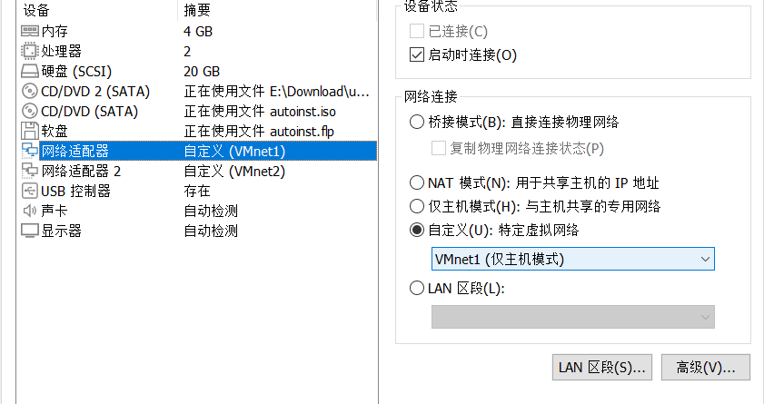
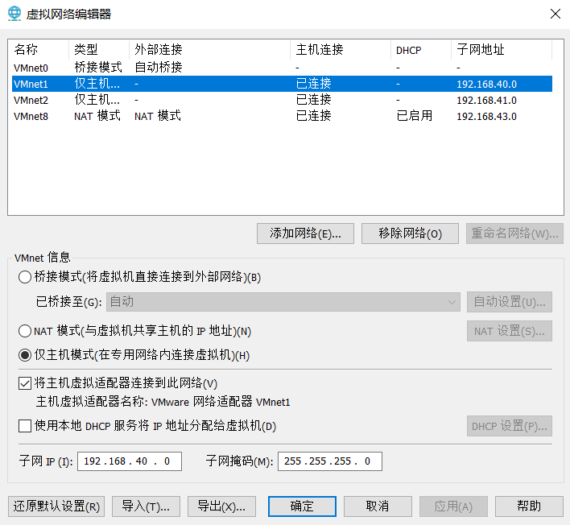
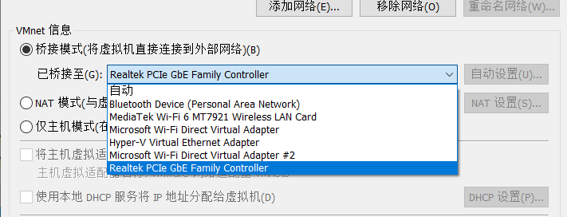
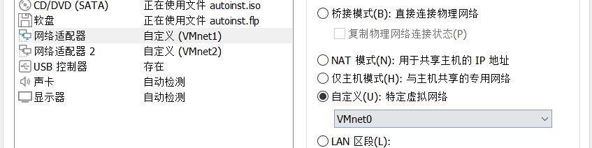

## 项目环境

### 编译和运行环境

#### 环境安装

实验使用的操作系统为Ubuntu 22.04 LTS，处理器为x86_64。编译环境为g++/gcc 11.4.0，c++语言标准为c++11。通过xmake组织实验项目，但也可以通过xmake自动生成的makefile进行整个项目的编译和链接。

全部安装指令为：

```shell
# gcc/g++
sudo apt install gcc
sudo apt install g++

# make
sudo apt install make

# xmake
curl -fsSL https://xmake.io/shget.text | bash
```

编译和运行指令为：

```shell
# 编译
xmake   # 或make

# 以root权限运行
sudo ./build/linux/x86_64/debug/ospf
```

#### 编译选项

由于在源码中使用了`std::thread`，在linux环境下需要链接`pthread`，因此需要添加`-lpthread`的链接选项。

在debug模式添加了`DEBUG`的预定义，可以在代码中打印一些运行信息。

初期为了防止本机测试环境和实验室环境的不同，考虑了静态链接，通过添加`-static`、`-static-libgcc`和`-static-libstdc++`链接选项完成，可以通过`ldd`命令查看链接的程序依赖的动态链接库。在实际组网时，发现实验室提供的主机为i686处理器，而且是32位的，因此即使用静态链接的方式也无法直接拷贝运行。

xmake中更改编译选项的指令如下：

```shell
# 切换模式
xmake f -m debug/release --static=true/false 
```

### 虚拟网络环境

#### GNS3安装

GNS3的all-in-one安装包可以在[官网下载](https://www.gns3.com/software/download)，安装过程中会自动安装Wireshark和WinPcap等所需软件。GNS3还需要一个VM虚拟机镜像来运行路由器，这个虚拟机可以是VMware、VirtualBox或者QEMU等，我用的是VMware Workstation Pro 17。GNS3官方镜像可以在[这里](https://gns3.com/software/download-vm)下载。

GNS3也可以在宿主机上直接运行，但是实际测试时出现了模拟器内ping不通实体机网卡的情况，因此仍然用虚拟机运行GNS3。在运行GNS3的虚拟机时要在“编辑此虚拟机设置->处理器”里把相关的优化取消勾选。

#### 路由器镜像

华三（H3C）给了完整的虚拟机镜像，可以在[这里](https://www.h3c.com/cn/d_202307/1890428_30005_0.htm)下载。也可以在网络上下载Cisco的路由器镜像，选则c3745和c7200两个路由器镜像。

路由器镜像在GNS3内从“Edit->Preference->IOS router”里导入即可。

#### GNS3联通虚拟机

需要在GNS3内添加一个Cloud节点，在Configure中勾选Show special Ethernet interfaces。如果使用WSL2进行实验测试，需要添加WSL2的虚拟网卡vEthernet；如果使用VMWare，则添加VMware Network Adapter VMnet*，VMWare的虚拟网络适配器设置为“仅主机”或NAT均可。



将连接到Cloud的路由器接口IP地址设置与虚拟网卡IP地址在同一子网即可，可以通过ping命令测试连通性。注意不能将IP地址设为实体机中网关的地址，会造成冲突。

#### GNS3配置路由器

c3745路由器默认只有两个高速以太网口，可以在“Configure->Slots”里添加更多的接口，比如NM-1FE-TX可以增加一个高速以太网口。

#### 双网卡配置

由于WSL2的双虚拟网卡配置非常复杂，并且与实体网卡的桥接效果也不理想，因此双网卡主要使用VMWare的虚拟网络适配器完成。

搭建仿真环境时，需要首先“编辑->虚拟网络编辑器->更改设置”中将至少2个网卡设置为仅主机/NAT模式，注意要选中“将主机虚拟网络适配器连接到此网络”，这样才能在宿主机中找到该虚拟网络适配器，然后连接到GNS3的cloud。然后对运行用的虚拟机编辑其设置，添加一个网络适配器，并选择自定义，使用刚刚添加的虚拟网络适配器。



### 真实网络环境

#### 组网实验桥接

以上是搭建模拟实验环境的步骤，在线下组网实验时，需要保证主机上有2个及以上的物理以太网卡（可以通过拓展坞实现），然后在VMWare的“编辑->虚拟网络编辑器->更改设置”中选择某个虚拟网卡，然后设为桥接模式，在“已桥接至”选项中选择真实的物理网卡。



然后虚拟机编辑，将两个网络适配器调整为分别使用相应的网卡即可。对于VMNet0而言，直接使用桥接模式也可以达到同样的效果。



将宿主机和虚拟机的ip调整为同一地址，将真实的路由器的接口ip进行配置后通过ping命令进行测试。如果发现宿主机的ip地址已经被自动分配，并且在Windows下编辑网络适配器的ipv4地址无效，可以尝试将无线网络关闭后重新配置。