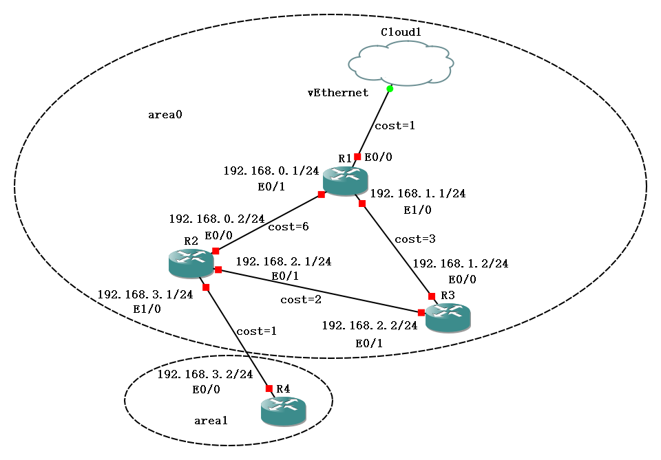

# 实验环境

## 仿真环境安装

我用的仿真环境是GNS3，用WSL2模拟运行OSPF所需要的路由器。

### GNS3安装

GNS3的all-in-one安装包可以在[官网下载](https://www.gns3.com/software/download)，安装过程中会自动安装Wireshark和WinPcap等所需软件。

GNS3还需要一个VM虚拟机镜像来运行路由器，这个虚拟机可以是VMware、VirtualBox或者QEMU等，我用的是VMware Workstation Pro 17。GNS3官方镜像可以在[这里](https://gns3.com/software/download-vm)下载。

### 路由器镜像

原本想用H3C或者华为的路由器，但是没搜到华为的路由器镜像，华三挺不错，给了完整的虚拟机镜像，可以在[这里](https://www.h3c.com/cn/d_202307/1890428_30005_0.htm)下载。

最后在网上搜了Cisco的路由器镜像（这个倒是到处都是），选了c3745和c7200两个路由器镜像，从“Edit->Preference->IOS router”里导入即可。

### GNS3内联通虚拟机

需要在GNS3内添加一个Cloud节点，在Configure中勾选Show special Ethernet interfaces，然后添加WSL的虚拟网卡vEthernet。将连接到Cloud的路由器接口IP地址设置与WSl的虚拟网卡IP地址在同一子网即可，可以通过ping命令测试连通性。

### 拓展路由器

c3745路由器默认只有两个告诉以太网口，但是我们可以在“Configure->Slots”里添加更多的接口，比如NM-1FE-TX可以增加一个高速以太网口。

### 其它注意事项

如果不是Intel的CPU，在运行GNS3的虚拟机时要在“编辑此虚拟机设置->处理器”里把相关的优化取消勾选。

我本来在Ubuntu22.04上装了物理机的GNS3，然后尝试用真实网卡通信，调了一晚没ping通，才尝试的用GNS3和WSL2两个虚拟机来搭建实验环境，没想到一次就ping通了...

## 自治域搭建

### 组网

模式实验的自治域组网如图所示：



由于WSL每次重启虚拟网卡的接口IP都会改变，因此R1和Cloud1之间的网络需要根据实际情况配置。

### 路由器配置

思科和华三的路由器配置命令有些不同，但是基本思路是一样的。

比如R1的配置如下：

```shell
configure terminal
interface FastEthernet 0/1
ip address 192.168.0.1 255.255.255.0
ip ospf cost 6
no shutdown
exit
interface FastEthernet 1/0
ip address 192.168.1.1 255.255.255.0
ip ospf cost 3
no shutdown
exit
router ospf 1
network 192.168.0.0 0.0.0.255 area 0
network 192.168.1.0 0.0.0.255 area 0
exit
exit
write memory
copy running-config startup-config
```

`./gns3`目录下保存了我导出的启动配置。