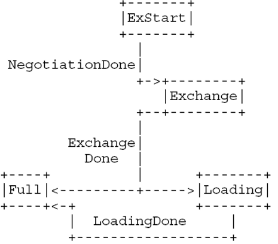

# 邻接

## 邻居状态机

完整的邻居状态机如图下面两张图片所示：

由Hello报文触发：

由数据库更新触发：

## 实验

优先实现最基本的一条状态路径：`Down -> Init -> 2-Way -> ExStart -> Exchange -> Loading -> Full`。

1. `Down -> Init`：收到Hello报文，进入Init状态。
2. `Init -> 2-Way`：收到Hello报文，发现自己的Router ID，进入2-Way状态。
3. `2-Way -> ExStart`：需要与邻居建立邻接，即在Hello报文中未看到自己的Router ID，进入ExStart状态。
4. `ExStart -> Exchange`：决定Master/Slave，进入Exchange状态。
5. `Exchange -> Loading`：路由器交换DD报文以描述它们各自的链路状态数据库。如果有差异，进入Loading状态，否则进入Full状态。
6. `Loading -> Full`：在Loading状态，路由器通过发送LSR报文请求邻居发送所有它还没有的LSA。一旦路由器完成了所有的LSA请求，并且LSDB与邻居的完全一致，路由器就进入Full状态。在这个状态下，邻居关系建立完成，OSPF路由器可以使用该邻居的信息进行路由计算。
